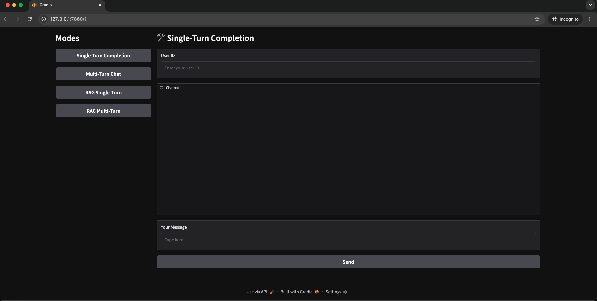
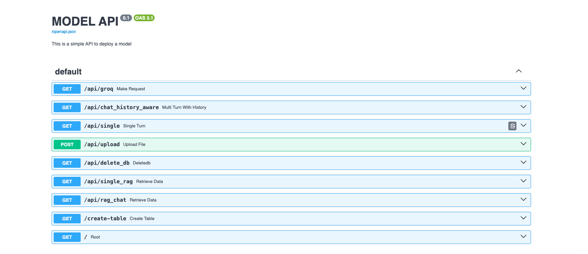

# Converse: A Conversational AI Demo

## Introduction
Converse is a conversational AI demo that showcases the capabilities of the DeepSeek R1 model, Hugging Face embeddings, and the LLaMA Index framework. 

## Client-Side

## Server-Side

## Features
* **Conversational Interface**: Engage in natural-sounding conversations with the AI model.
* **Response Generation**: The AI model generates responses based on the user's input.
* **DeepSeek R1 Model**: A conversational AI model developed by Groq.
* **Hugging Face Embeddings**: A library of pre-trained embeddings for natural language processing.
* **LLaMA Index Framework**: A framework for building and querying large language models.
* **Chroma DB**: A vector store for efficient storage and retrieval of embeddings.
* **Client-Side Interface**: Built using Gradio, a Python library for building user interfaces.

## Technologies Used
* **DeepSeek R1 Model**: A conversational AI model developed by Groq.
* **Hugging Face Embeddings**: A library of pre-trained embeddings for natural language processing.
* **Python**: The programming language used to develop the project.
* **Groq API**: A cloud-based API for natural language processing.
* **LLaMA Index Framework**: A framework for building and querying large language models.
* **Chroma DB**: A vector store for efficient storage and retrieval of embeddings.
* **Gradio**: A Python library for building user interfaces.

## Setup and Usage
1. Clone the repository: `git clone https://github.com/your-username/converse.git`
2. Install the required dependencies: `poetry install`
3. Run the server: `poetry run python main.py`
4. Client is up on local URL:  `http://127.0.0.1:7860`
5. Open a web browser and navigate to `http://localhost:8000` to interact with the AI model.

## Example Use Cases
* **Simple Conversation**: Ask the AI model a question, and it will respond accordingly.
* **Multi-Turn Conversation**: Engage in a conversation with the AI model, and it will respond based on the context.
* **Retrieval-Augmented Generation (RAG)**: Use the AI model to generate responses based on a set of documents or knowledge base.
* **Vector Store**: Use Chroma DB to store and retrieve embeddings for efficient querying.

## Future Enhancements
* **Improved Response Generation**: Enhance the AI model's ability to generate more accurate and informative responses.
* **Client Side**: The human interaction part, markdown rendering.
* **Emotional Intelligence**: Integrate emotional intelligence into the AI model to make it more empathetic and understanding.
* **Multimodal Interaction**: Allow users to interact with the AI model using multiple modalities, such as voice or text.

